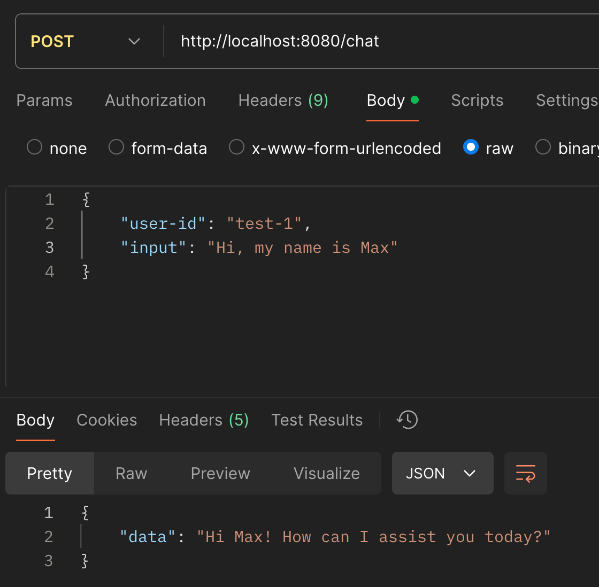
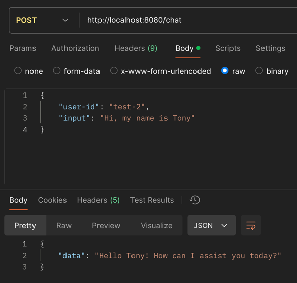
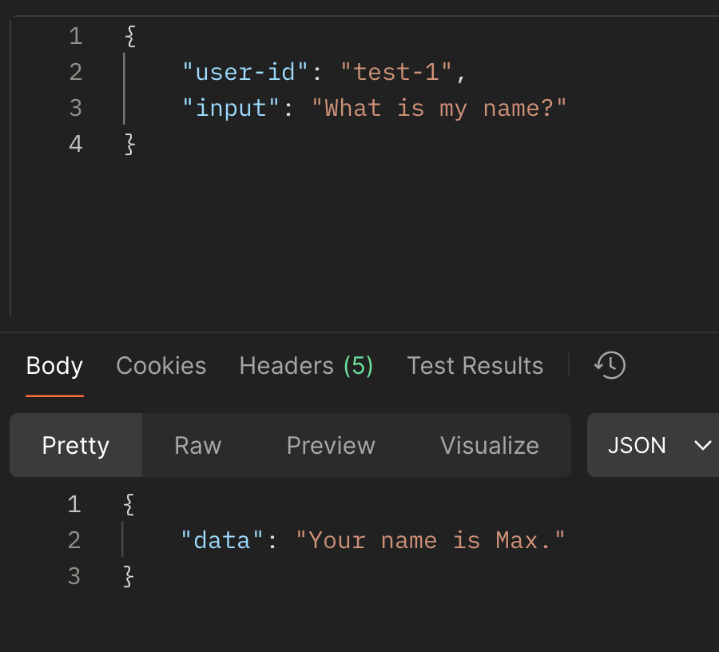
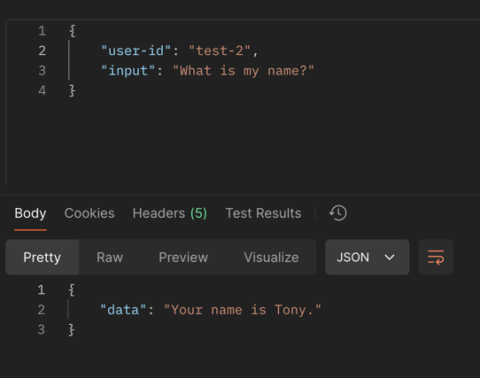
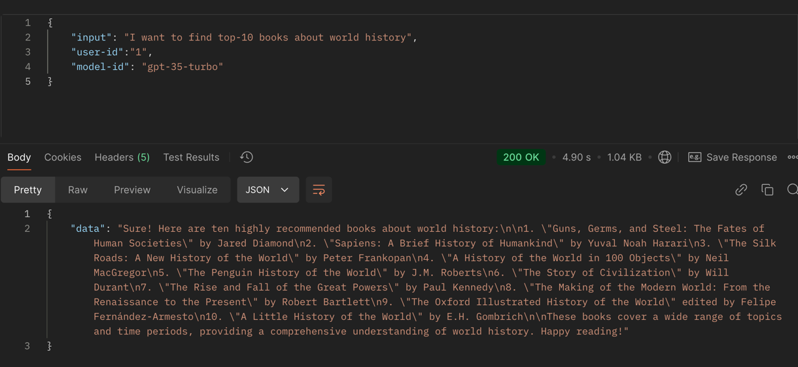
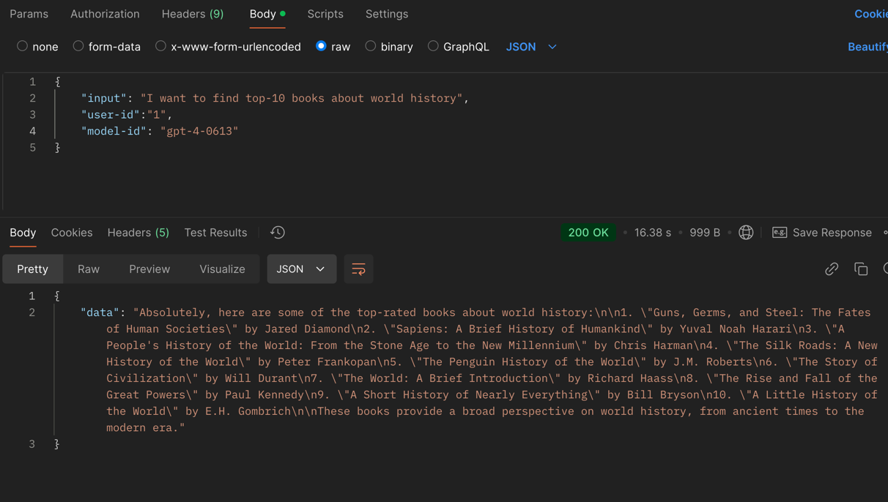

# java-gen-ai-course

## Lab 1:

- Temperature: 0.1:
  

- Temperature: 0.2 (may occur some hallucinations):
  

## Lab 2:

I`ve done some tests to check chat memory:

1. Greet to llm using `test-1` as user-id:
   

2. Greet to llm using `test-2` as user-id:
   

3. Ask llm about my name using `test-1` user-id:
   

4. Ask llm about my name using `test-2` user-id:
   

## Lab 3:

1. Call API with `gpt-35-turbo`:
   
2. Call API with `gpt-4-0613`:
   
