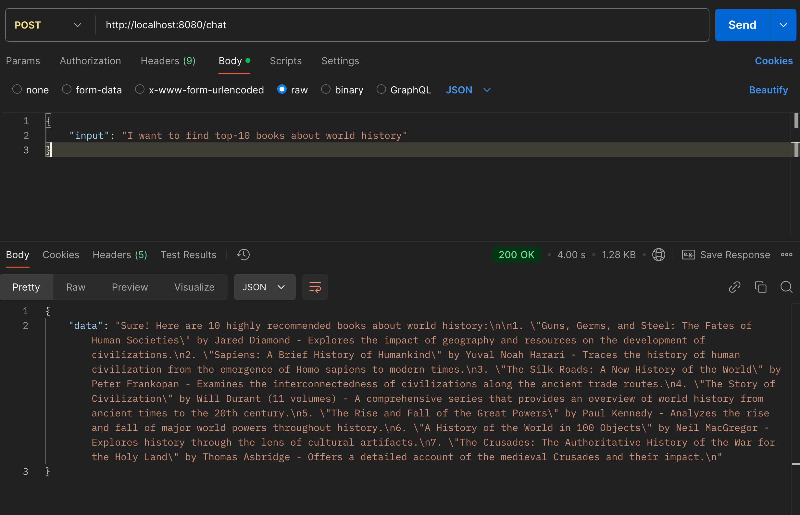
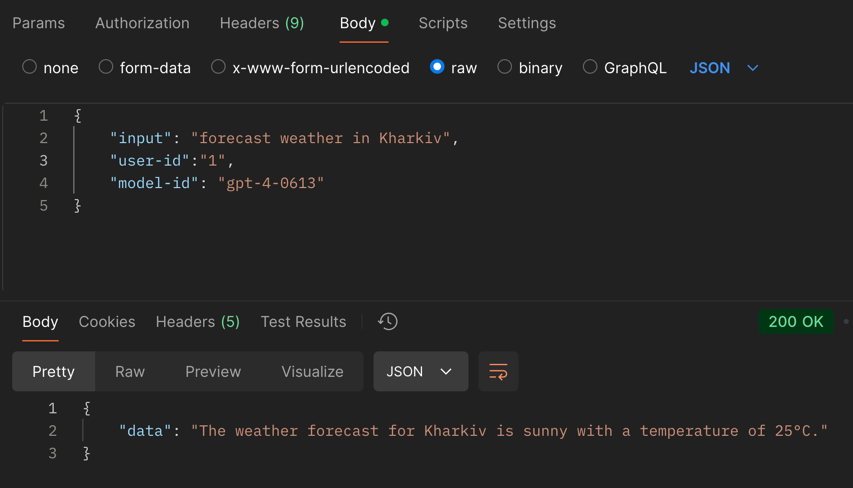

# java-gen-ai-course

## Lab 1:

- Temperature: 0.1:
  

- Temperature: 0.2 (may occur some hallucinations):
  

---

## Lab 2:

I`ve done some tests to check chat memory:

1. Greet to llm using `test-1` as user-id:

   

2. Greet to llm using `test-2` as user-id:

   

3. Ask llm about my name using `test-1` user-id:

   

4. Ask llm about my name using `test-2` user-id:

   

---

## Lab 3:

1. Call API with `gpt-35-turbo`:

   

2. Call API with `gpt-4-0613`:

   

---

## Lab 4:

Plugins:

1. Call `AgeCalculatorPlugin`:

   

2. Call `WeatherForecastPlugin`:

   

3. Call `CurrencyConverterPlugin`:

   

- Logs output:

  

## Lab 5:

1. Call `build` endpoint to get embeddings for `text` field:

  

2. Call `build and store` endpoint to get embedding and store result to vector DB:

  

3. Call `search` endpoint to search similarity by input `text` field:

  

## Lab 6:

1. Upload to context [christmasday.pdf](docs/christmasday.pdf):

2. Check qdrant collections:

3. Ask question from context:

4. Ask not related to context question:

